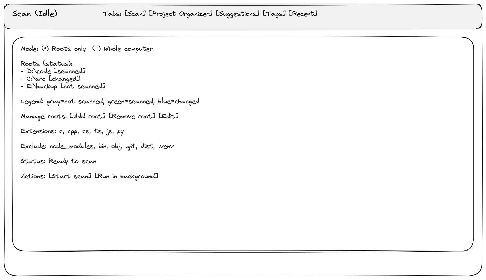
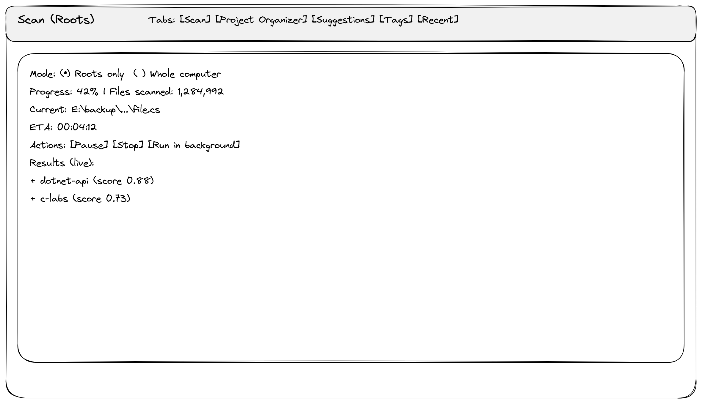
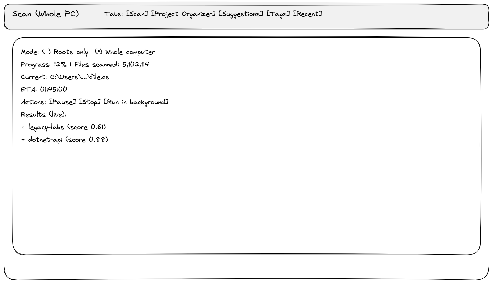
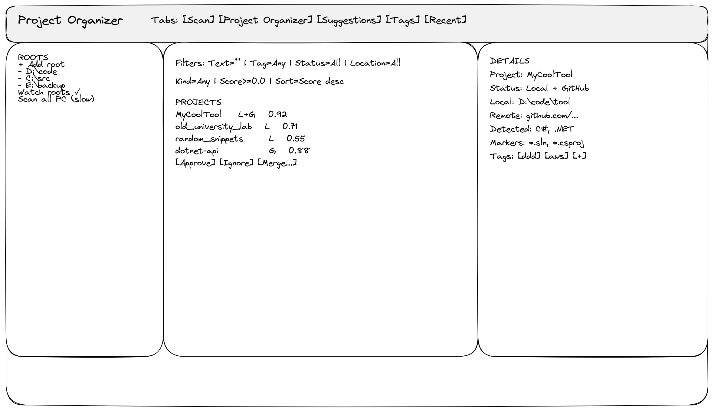
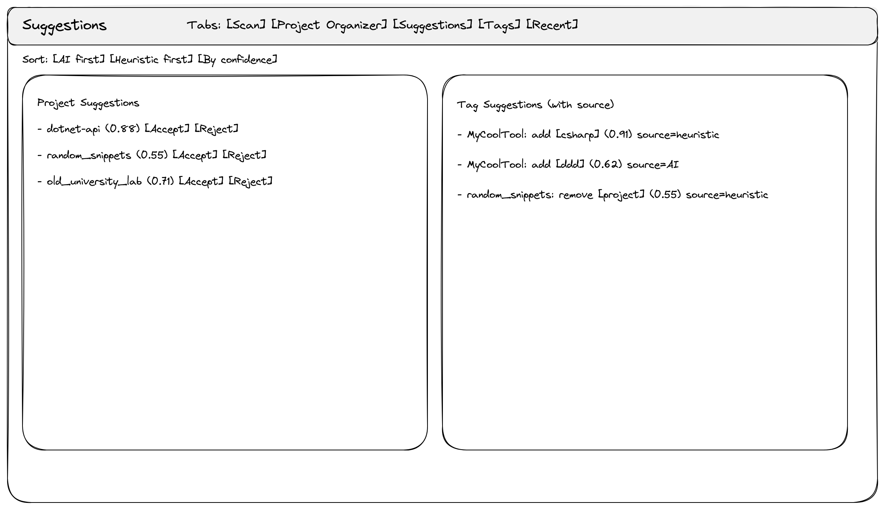
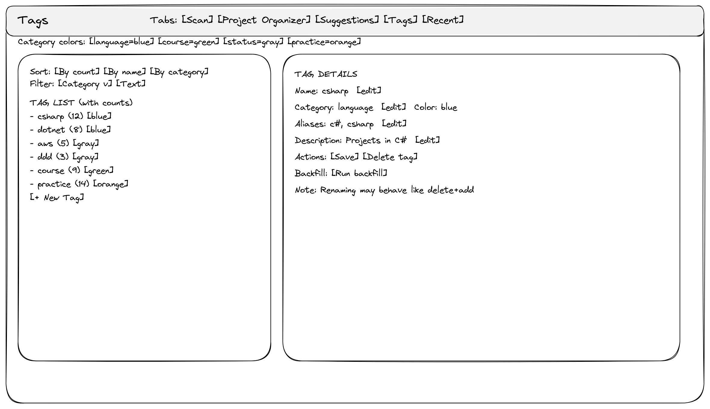
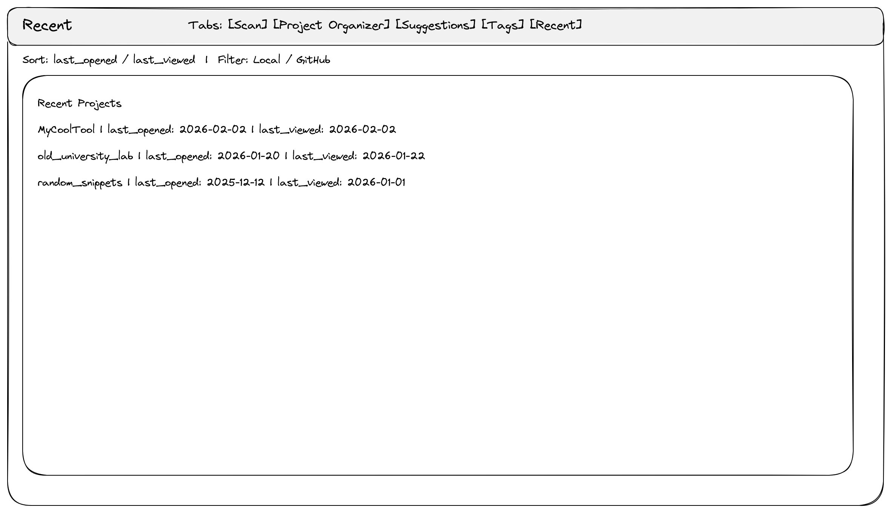

# Specyfikacja: Program do porządkowania projektów

## 1. Spis treści
- [2. Cel i zakres](#2-cel-i-zakres)
- [3. Kontekst i stan na teraz](#3-kontekst-i-stan-na-teraz)
- [4. Definicje robocze](#4-definicje-robocze)
- [5. Architektura i przepływ](#5-architektura-i-przepływ)
- [6. Model danych i tagowanie](#6-model-danych-i-tagowanie)
- [7. Skanowanie i deduplikacja](#7-skanowanie-i-deduplikacja)
- [8. Recent: last_viewed i last_opened](#8-recent-last_viewed-i-last_opened)
- [9. GUI: widoki i przepływy](#9-gui-widoki-i-przepływy)
- [10. Integracja GitHub i autoryzacja](#10-integracja-github-i-autoryzacja)
- [11. Reguły: wejście -> wyjście](#11-reguły-wejście---wyjście)
- [12. Plan etapów](#12-plan-etapów)
- [13. Najbliższe kroki](#13-najbliższe-kroki)

## 2. Cel i zakres
Program skanuje wskazane lokalizacje na dysku, wykrywa projekty (nawet pojedyncze pliki), klasyfikuje je heurystycznie, pozwala tagować oraz przeglądać w GUI. Dodatkowo unika podwójnego skanowania tej samej fizycznej ścieżki i obsługuje skróty oraz reparse points.

Faza projektowa (obecny fokus): doprecyzowanie modelu danych, reguł i przepływów UX, ze szczególnym naciskiem na warstwę tagowania, skanowanie oraz „recently viewed/opened”.

[↑ do góry](#1-spis-treści)

## 3. Kontekst i stan na teraz
- Posiadasz skrypt `tree-lite.ps1`, który generuje tekstowe drzewo katalogów w formacie:
  `Folder\ [files=... markers=... ext=...]`.
- Skrypt omija katalogi z listy `NoRecurseDirs` (np. `.git`, `node_modules`, `bin`, `obj`, `.vs`, `.history`, itd.).
- W trybie `MarkersOnly` drukuje tylko pliki-markery, ale nadal liczy rozszerzenia do podsumowania.
- Wynik działania zapisujesz do `result.txt`, który jest materiałem wejściowym do analizy heurystyk.

[↑ do góry](#1-spis-treści)

## 4. Definicje robocze
Projekt to:
- klasyczny repozytorium lub struktura z markerami (np. `.git`, `package.json`, `*.csproj`), lub
- katalog zawierający spójny zestaw plików źródłowych, nawet jeśli to pojedynczy plik (SingleFileMiniProject).

Rodzaje klasyfikacji (v1):
- `ProjectRoot`
- `Submodule`
- `Collection`
- `SingleFileMiniProject`
- `Ignore`

Status projektu (nie jest tagiem):
- `Local`
- `GitHub`
- `Local + GitHub`
- `Archived` (opcjonalnie w przyszłości)

Granularność i niejednoznaczne foldery (v1):
- jeśli są markery repo/projektu -> traktujemy jako `ProjectRoot`.
- jeśli brak markerów i tylko pojedynczy plik źródłowy -> `SingleFileMiniProject`.
- jeśli brak markerów i wiele plików -> `Collection` jako kandydat + opcjonalne kandydaty `SingleFileMiniProject` dla pojedynczych plików.
- w przypadkach niejednoznacznych decyzję o podziale podejmuje użytkownik, a opcjonalnie można wesprzeć się AI (opcja opt-in).

[↑ do góry](#1-spis-treści)

## 5. Architektura i przepływ
1. Skan wskazanych rootów (lub całego dysku) -> lista `ProjectSuggestion`.
2. Użytkownik potwierdza kandydat -> powstaje `Project`.
3. Auto-sugestie tagów -> użytkownik akceptuje lub odrzuca.
4. Użytkownik może tworzyć nowe tagi i uruchamiać backfill.
5. Po utworzeniu projektu użytkownik może uruchomić „Sugestie tagów” (heurystyki, opcjonalnie AI).
6. GUI pokazuje kluczowe widoki: „Skan”, „Project Organizer”, „Sugestie”, „Tagi”, „Recent”.

[↑ do góry](#1-spis-treści)

## 6. Model danych i tagowanie

### 6.1. Model danych (v1)
Wspólne pola dla wszystkich encji:
- `id`: unikalny identyfikator rekordu.
- `created_at`: data utworzenia rekordu.
- `updated_at`: data ostatniej modyfikacji rekordu.
- `notes` (opcjonalne): notatki użytkownika lub systemu.

Project (logiczny byt):
- `name`: przyjazna nazwa projektu (wyświetlana w UI).
- `canonical_path`: kanoniczna (zdeterminowana) ścieżka do deduplikacji.
- `alt_paths[]`: alternatywne ścieżki prowadzące do tego samego projektu.
- `local_path` (opcjonalny): główna ścieżka lokalna, jeśli projekt jest na dysku.
- `remote_path` (opcjonalny, np. GitHub URL): zdalna lokalizacja repo.
- `status` (Local | GitHub | Local + GitHub | Archived): status dostępności projektu.
- `kind`: typ projektu (np. `ProjectRoot`, `Collection`, `SingleFileMiniProject`).
- `score`: wynik heurystyki (siła kandydata).
- `tech_hints[]`: podpowiedzi technologii (np. języki, frameworki).
- `markers[]`: wykryte markery projektu (np. `.git`, `package.json`).
- `ext_counts{}`: histogram rozszerzeń (np. `{ "ts": 24, "md": 3 }`).
- `file_count`: liczba plików w projekcie (wg skanu).
- `last_scanned_at`: ostatni czas skanowania projektu.
- `last_viewed_at`: ostatni czas podglądu w UI.
- `last_opened_at`: ostatni czas uruchomienia/otwarcia projektu.

ProjectLocation (ProjectL) - gdy potrzebne rozbicie lokalizacji:
- `project_id`: referencja do `Project`.
- `location_type` (local | github): typ lokalizacji.
- `path_or_url`: ścieżka lokalna lub URL zdalny.
- `is_primary`: czy to lokalizacja główna.
- `last_seen_at`: ostatni raz, kiedy lokalizację wykryto podczas skanu.

Tag:
- `name`: nazwa taga widoczna dla użytkownika.
- `slug`: znormalizowana nazwa (np. do wyszukiwania i URL).
- `category` (opcjonalna, np. `language`, `course`, `status`): grupa taga.
- `aliases[]` (synonimy, skróty, alternatywne nazwy): alternatywne nazwy.
- `description`: krótki opis znaczenia taga.

ProjectTag (relacja wiele-do-wielu):
- `project_id`: referencja do `Project`.
- `tag_id`: referencja do `Tag`.
- `source` (user | heuristic | ai): źródło przypisania.
- `confidence` (0..1): pewność przypisania (dla heurystyk/AI).
- `applied_at`: data przypięcia taga do projektu.

TagSuggestion:
- `project_id`: referencja do `Project`.
- `tag_id` lub `tag_name`: istniejący tag lub nowy tag do utworzenia.
- `action` (add | remove | replace): proponowana akcja.
- `confidence`: pewność sugestii (0..1).
- `source` (heuristic | ai | user): źródło sugestii.
- `reason` (krótki opis: „package.json”, „ext=ts=24”): powód sugestii.
- `status` (pending | accepted | rejected): stan rozpatrzenia.
- `created_at`: data utworzenia sugestii.
- `resolved_at`: data akceptacji/odrzucenia.

ProjectSuggestion:
- `path` (folder lub pojedynczy plik): wykryta lokalizacja kandydata.
- `name`: proponowana nazwa projektu.
- `score`: wynik heurystyki wykrycia.
- `suggested_kind` (ProjectRoot | Collection | SingleFileMiniProject): proponowany typ.
- `markers[]`: markery, które wpłynęły na wykrycie.
- `ext_counts{}`: histogram rozszerzeń w kandydacie.
- `file_count`: liczba plików w kandydacie.
- `depth`: głębokość względem rootu skanu.
- `status` (pending | accepted | rejected): stan decyzji.
- `first_seen_at`: pierwszy raz wykryty podczas skanu.
- `last_seen_at`: ostatni raz wykryty podczas skanu.

### 6.2. Workflow UX (bez UI implementacji)
1. Scan -> lista `ProjectSuggestion`.
2. User „accept/confirm” -> tworzy się `Project`.
3. Auto Tag Suggestion -> user:
   - wybiera istniejące tagi,
   - i/lub tworzy nowy tag.
4. Po utworzeniu nowego taga dostępny przycisk „Uruchom backfill” -> generuje sugestie dla już znanych projektów (heurystyki, a opcjonalnie AI).
5. Po utworzeniu projektu użytkownik może ręcznie uruchomić „Sugestie tagów” (heurystyki, a opcjonalnie AI).
6. Backfill i „Sugestie tagów” nigdy nie przypinają tagów automatycznie, tylko tworzą `TagSuggestion`.

### 6.3. Heurystyki sugerowania tagów (bez AI na start)
- Markery:
  - `package.json` -> tag `node` / `javascript` / `typescript` (zależnie od ext/tsconfig).
  - `*.csproj` / `*.sln` -> tag `.net` / `csharp`.
  - `CMakeLists.txt` -> tag `cpp`.
  - `Cargo.toml` -> tag `rust`.
  - `go.mod` -> tag `go`.
- Histogram rozszerzeń:
  - przewaga `*.py` -> tag `python`.
  - przewaga `*.cpp`/`*.h` -> tag `cpp`.
  - przewaga `*.cs` -> tag `csharp`.
- Nazwy folderów i ścieżek:
  - `udemy`, `course`, `tutorial` -> tag `course`.
  - `katas`, `exercises` -> tag `practice`.
- Struktura:
  - `src`, `tests`, `docs` -> wzmacnia confidence.

Wynik heurystyk:
- lista `TagSuggestion` z `confidence` i `reason`.

### 6.4. AI jako drugi krok (opcjonalnie)
Cel: po heurystykach uruchomić AI jako dodatkowe źródło sugestii tagów.

Opcjonalny use-case dodatkowy:
- rozstrzyganie niejednoznacznej granularności (czy folder to jeden projekt, czy wiele),
- wejście do AI ograniczone rozmiarem: drzewo + nazwy plików + krótkie próbki treści,
- jeśli przekroczymy limit, wracamy do heurystyk i decyzji użytkownika.

Założenia:
- AI nigdy nie przypina tagów automatycznie, tylko generuje `TagSuggestion`.
- Wysyłamy zserializowany „skrót projektu” (markery, ext_counts, nazwy folderów, krótki opis, lista istniejących tagów).
- Wymagamy odpowiedzi w ściśle określonym formacie (np. JSON Schema) i parsujemy deterministycznie.
- W konfiguracji przechowujemy `api_key`, `model`, `timeout`, `max_tokens` i limit kosztu.

Wejście do AI (przykład struktury):
- `project_summary`: path, markers, ext_counts, top_paths
- `existing_tags`: lista tagów i aliasów
- `instruction`: zwróć listę tagów z confidence i reason

Wyjście z AI:
- lista `TagSuggestion` z `source=ai`.

[↑ do góry](#1-spis-treści)

## 7. Skanowanie i deduplikacja
- Skan wskazanych rootów lub całego dysku.
- Rooty skanowania są definiowane przez użytkownika i mogą być watchowane.
- Skan całego PC to osobna, wolna operacja typu opt-in.
- Ignorowanie `NoRecurseDirs` oraz plików binarnych/cache.
- Limity głębokości i liczby dzieci per folder.
- Dedup po realnej ścieżce (np. symlink/junction/ten sam target).
- `.lnk`:
  - nie wchodzić w rekursję,
  - zapisać jako „link” w raporcie,
  - zasugerować użycie prawdziwej ścieżki jako osobnego rootu.

### 7.1. Stan skanów (do incremental scan)
Przechowywane informacje:
- `ScanRoot`: ścieżka, status aktywny, watch_enabled.
- `ScanRun`: start, end, tryb (roots / whole), wynik (ok / error), statystyki (files_scanned, folders_scanned).
- `ScanFolderState`: path, last_scanned_at, last_modified_at, hash_metadata (opcjonalnie).

Skan incremental:
- skanuj tylko foldery, które mają `last_modified_at` > `last_scanned_at`.
- jeśli brak stanu, traktuj folder jako „nowy”.
- stan w UI: „niezeskanowane”, „zeskanowane”, „zmienione od ostatniego skanu” (kolory ustalimy w makietach).
- decyzja UX: domyślnie skanuj tylko „zmienione”, a pełny rescan jako akcja użytkownika.

[↑ do góry](#1-spis-treści)

## 8. Recent: last_viewed i last_opened
- `last_opened_at`:
  - aktualizowane, gdy użytkownik otwiera projekt z naszej aplikacji,
  - w przyszłości również przy integracji z edytorem (np. VS Code, globalny hook).
- `last_viewed_at`:
  - aktualizowane, gdy użytkownik otwiera szczegóły projektu w aplikacji,
  - lekkie „dotknięcie” bez uruchamiania projektu.

[↑ do góry](#1-spis-treści)

## 9. GUI: widoki i przepływy
Najpierw powstają makiety bez logiki, tylko wygląd i układ. Dopiero później podpinamy logikę skanowania i tagowania.

W każdym widoku jest stały pasek nawigacji (tabs) do przełączania między ekranami: `Skan`, `Project Organizer`, `Sugestie`, `Tagi`, `Recent`.

### 9.1. Widok „Skan” (MVP)
- Cel: uruchomienie skanu, wybór rootów, podgląd postępu i wyników na żywo.
- Makiety stanów:
  - 9.1.1 (przed startem skanu):
    - Excalidraw: `docs/excalidraw/view-9-1-1-scan-idle.excalidraw`
    - PNG: `docs/images/view-9-1-1-scan-idle.png`
    - 
  - 9.1.2 (skan rootów w trakcie):
    - Excalidraw: `docs/excalidraw/view-9-1-2-scan-roots.excalidraw`
    - PNG: `docs/images/view-9-1-2-scan-roots.png`
    - 
  - 9.1.3 (skan całego komputera):
    - Excalidraw: `docs/excalidraw/view-9-1-3-scan-whole.excalidraw`
    - PNG: `docs/images/view-9-1-3-scan-whole.png`
    - 

### 9.2. Widok główny „Project Organizer”
- Cel: centralny ekran z listą projektów, rootów i szczegółami.
- Excalidraw: `docs/excalidraw/view-9-2-project-organizer.excalidraw`
- PNG: `docs/images/view-9-2-project-organizer.png`

- Filtry widoczne bezpośrednio nad listą projektów (tag, status, lokalizacja, score, tekst).
- „Suggestions” przeniesione w całości do widoku 9.3 (nie dublujemy ich na dole).

### 9.3. Widok „Sugestie”
- Cel: akceptacja/odrzucanie `ProjectSuggestion` i `TagSuggestion`.
- Excalidraw: `docs/excalidraw/view-9-3-suggestions.excalidraw`
- PNG: `docs/images/view-9-3-suggestions.png`

- Każda sugestia zawiera `source` (heurystyka / AI).
- Możliwość sortowania według źródła (AI → heurystyki lub odwrotnie).

### 9.4. Widok „Tagi”
- Cel: zarządzanie tagami, aliasami i uruchamianie backfill.
- Excalidraw: `docs/excalidraw/view-9-4-tags.excalidraw`
- PNG: `docs/images/view-9-4-tags.png`

- Lista tagów zawiera licznik przypiętych projektów (np. `csharp (12)`).
- Sortowanie: wg liczby projektów, nazwy i kategorii.
- Kategorie tagów: edytowalne, z przypisanym kolorem (legendą).
- Edycja taga (rename) jest możliwa, ale UX powinien informować, że w praktyce może to działać jak „usuń i dodaj nowy” (z ewentualnym backfill).

### 9.5. Widok „Recent”
- Cel: lista projektów wg `last_opened_at` i `last_viewed_at`.
- Excalidraw: `docs/excalidraw/view-9-5-recent.excalidraw`
- PNG: `docs/images/view-9-5-recent.png`

[↑ do góry](#1-spis-treści)

## 10. Integracja GitHub i autoryzacja
- Projekty z GitHuba są traktowane tak samo jak lokalne i mogą mieć tagi.
- Projekt z GitHuba może nie mieć `local_path`.
- Po klonowaniu lokalnym status staje się `Local + GitHub`.
- Planowane akcje: `clone project`, `unlink local copy`, `archive local files`.

Autoryzacja (propozycja):
- Preferowany tryb: OAuth Device Flow dla aplikacji desktopowej.
- Alternatywa: Personal Access Token (PAT) wklejany przez użytkownika.
- Tokeny przechowywane w bezpiecznym magazynie systemowym (Windows Credential Manager).

[↑ do góry](#1-spis-treści)

## 11. Reguły: wejście -> wyjście
Dane wejściowe:
- skan drzewa katalogów (np. `result.txt`),
- markery, ext-histogram, struktura folderów,
- ścieżki i nazwy katalogów,
- źródła zdalne (GitHub), gdy włączone.

Reguły i wyjścia:
1. Skan -> `ProjectSuggestion[]` z `score` i `reason`.
2. Akceptacja -> `Project` + początkowe `ProjectTag[]` (jeśli użytkownik doda).
3. Heurystyki tagów -> `TagSuggestion[]` z `confidence`.
4. AI tagów (opcjonalnie) -> `TagSuggestion[]` z `source=ai`.
5. Akceptacja sugestii -> `ProjectTag[]`.
6. Backfill -> nowe `TagSuggestion[]` dla istniejących `Project`.

[↑ do góry](#1-spis-treści)

## 12. Plan etapów

### Etap 1 — Specyfikacja i format danych
Rezultat: dokument specyfikacji + format danych.

### Etap 2 — GUI (makiety bez logiki)
Rezultat: klikalne widoki bez działania, do weryfikacji UX.

### Etap 3 — Silnik skanowania (CLI) + reguły ignorowania
Rezultat: działający skaner CLI tworzący index JSON/SQLite.

### Etap 4 — Heurystyka klasyfikacji v1
Rezultat: raport klasyfikacji + testy na lokalnych danych.

### Etap 5 — Magazyn (SQLite) + skan incremental
Rezultat: indeks w SQLite i szybkie aktualizacje.

### Etap 6 — Tagowanie + sugestie
Rezultat: workflow tagowania (manual + automatyczne).

### Etap 7 — Integracja z GitHub
Rezultat: wykrywanie repo i metadanych + autoryzacja.

### Etap 8 — Eksport / raporty
Rezultat: generator raportów (Markdown/JSON/CSV).

### Etap 9 — Hardening i packaging
Rezultat: wersja „do używania”.

[↑ do góry](#1-spis-treści)

## 13. Najbliższe kroki
1. Zatwierdzić makiety i zestaw widoków MVP.
2. Ustalić kanoniczne rooty do skanu (szczególnie OneDrive po realnej ścieżce).
3. Przygotować 1–3 pliki `result.txt` z różnych rootów do kalibracji heurystyk.

[↑ do góry](#1-spis-treści)
